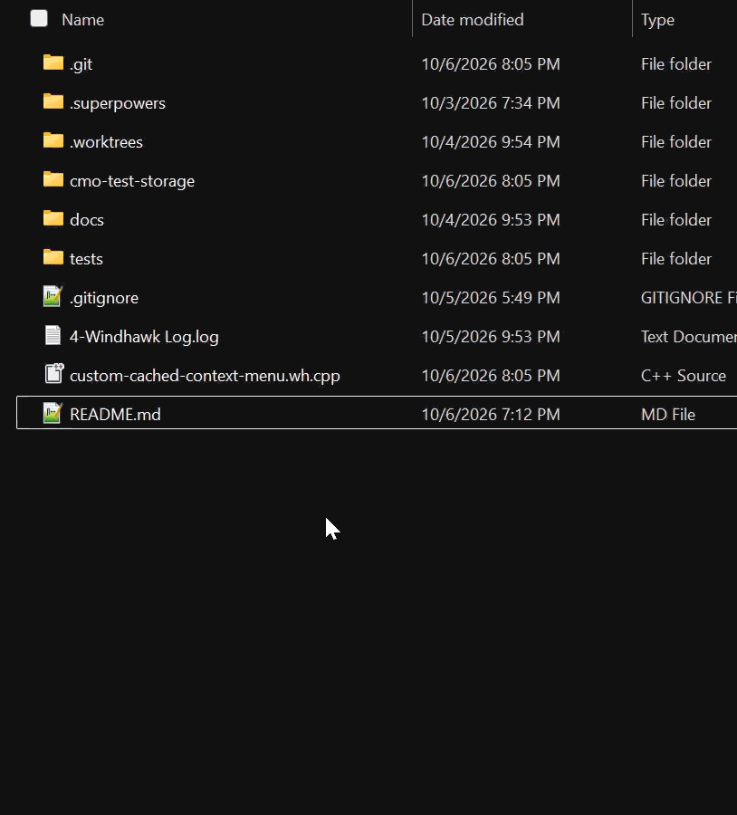
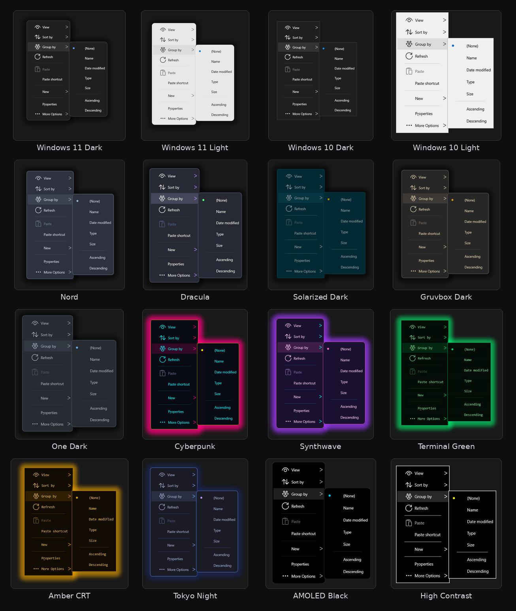

# Custom Cached Context Menu

A [Windhawk](https://windhawk.net/) mod that replaces the Windows Explorer file
and desktop context menu with an instantly-opening cached menu, then discovers
real shell extension items asynchronously in the background. It can render the
menu itself (DirectComposition/Direct2D, fully configurable via `menu.ini`) or
keep the classic owner-drawn menu as a fallback mode.



## Why

The native context menu is slow because every registered shell extension is
loaded synchronously before the menu can be shown — often hundreds of
milliseconds with a handful of handlers installed. This mod removes that work
from the interactive path:

1. Explorer's menu population call is intercepted and deferred.
2. A cached menu model is shown immediately (target: under 10 ms).
3. The real population runs afterwards, on the same UI thread, and refreshes
   the cache — so the next open already has full third-party handler parity.
4. Common contexts are pre-built in the background shortly after Explorer
   starts.

Hold **Shift** while right-clicking (or use **Show classic menu**) to get the
untouched native menu, including extended verbs.

## Features

- **Instant, cached menus** — the first open of a context discovers and caches
  the shell's items; later opens render from the cache. Models persist to disk
  (`menu-cache.bin`) and common contexts are pre-warmed at Explorer start.
- **Self-rendered menu** — Direct2D/DirectComposition instead of the classic
  owner-drawn menu: rounded corners, backdrop blur, drop shadows, per-item
  icons, hover/pressed feedback, a marker gutter, and keyboard navigation.
- **16 bundled themes** — Windows 11/10 dark and light, Nord, Dracula,
  Solarized, Gruvbox, One Dark, Cyberpunk, Synthwave, Terminal Green, Amber
  CRT, Tokyo Night, AMOLED Black, High Contrast — each a self-contained file
  you can edit or copy. See [Themes](#themes).
- **Animations** — combinable open/close effects (`fade`, `slide`, `scale`,
  `dissolve`, `crt`, `unfold`) with easing, per-frame timing, and optional
  submenu animation.
- **Overlays** — combinable effects drawn over the content (`noise`, `plasma`,
  `hue`, `glow`, `scanlines`, `vignette`) with intensity, speed, size, and
  frame interval. They only animate during open/close unless you opt in.
- **Adaptive shadow** — the drop shadow fades on dark backgrounds instead of
  reading as a black halo; colored theme glows keep their exact hue.
- **In-menu settings** — a live appearance editor in the advanced ("More
  options") submenu or via an optional global hotkey. Sliders with typed
  fields, an HSV color picker, font-face validation, and instant preview.
- **No code needed** — `menu.ini` supports rules (`hide`/`keep`/`move`),
  custom commands, custom submenus, per-item overrides, and an icon library.

## Install

1. Install [Windhawk](https://windhawk.net/).
2. Create a new mod and paste `custom-cached-context-menu.wh.cpp`, or install a
   published build from the Windhawk mod collection once available.
3. Compile and enable the mod for `explorer.exe`.

## Settings

| Setting | Default | Description |
|---|---|---|
| Theme | Custom (menu.ini) | Appearance source: `menu.ini`, or a theme file under `<mod storage>\themes\<name>.ini` created from the bundled preset on first use. |
| Menu mode | Custom (recommended) | Custom draws the self-rendered menu and falls back to the classic menu after repeated failures; Classic always uses the owner-drawn menu. |
| Shift bypass | on | Hold Shift while right-clicking to show the untouched native menu. |
| Instant menu open | on | Temporarily disables the system menu animation (fade and slide) while this mod's menu opens. Session-only; restored immediately. |
| Show classic menu item | on | Adds a "Show classic menu" entry at the bottom of the replacement menu. |
| Submenu open delay | 150 ms | Hover delay before a submenu opens; 0 = instant, -1 = keep the Windows setting. |
| Move Windows extras | on | Moves the configured Windows extras into the More options submenu. |
| Move third-party handlers | on | Moves third-party shell extension entries into the More options submenu. |
| Windows items to move | common list | Comma-separated labels or verbs of Windows items to move into the submenu. |
| Keep in the main menu | empty | Comma-separated third-party labels or verbs that stay in the main menu instead of moving into the submenu. |
| More options submenu label | `More options` | Label of the submenu that collects extra items. |
| Settings hotkey | empty | Optional global hotkey that opens the settings menu (for example `Ctrl+Alt+M`). Empty disables it. |
| Debug logging | off | Logs timings and diagnostics. |
| Clear cache | off | Turn on to delete cached models; they rebuild on next use. |
| Warm-up extensions | common list | Comma-separated file types whose menus are pre-built at Explorer startup. |
| Warm-up delay | 5 s | Seconds to wait after Explorer starts before warming the cache. |

### The settings menu

Every custom menu's **More options** submenu ends with **Menu settings…** (or,
when that submenu is absent, the main menu does), and the optional hotkey above
opens the same session. The settings menu is a normal menu rendered by the mod,
so it inherits the theme, animations, overlays, and blur.

It edits the **appearance only** — the keys in `[appearance]` — with live
preview: colors, layout, shadows, typography, animations, and overlays change
as you edit. Sliders apply spacing changes when you release them, and every
slider has a typed field for exact values; colors use an HSV picker with hex
and R/G/B/A fields; the font row edits the face with installed-font validation
and commits on Enter or when you click away. Edits are written back canonically:
to the active theme file when a theme is selected, otherwise to the effective
`menu.ini` section (Base / Light / Dark, selectable at the top). Saves are
debounced and atomic, and the status row shows `Saved` or `Save failed`.
Behavior settings (theme selection, menu mode, logging, delays, and so on) are
Windhawk settings the mod cannot write; they appear in the menu as read-only
hints.

## Themes



Pick a theme in the mod settings. The first time a theme is selected its file is
created from the bundled preset at
`<Windhawk mod storage>\themes\<name>.ini`; edit it directly (it is re-read
when the file changes), copy it as the starting point for your own palette, or
use the in-menu settings browser. Theme files are complete `[appearance]`
blocks and never inherit from `menu.ini`, so a theme is always self-contained
and selecting one never modifies `menu.ini`. **Custom (menu.ini)** uses
`menu.ini`'s appearance as before, and missing or invalid theme keys fall back
to the built-in preset (with a warning in the log).

## Customizing the menu (`menu.ini`)

`menu.ini` lives in the mod's storage directory (Windhawk → the mod's details →
Storage). It is created on first run as a commented settings list — almost
every setting active at its default, grouped with comment headers, colors as
`R, G, B, A` — and it is checked when a menu opens (nothing runs in the
background). Errors are logged as `menu.ini:<line>: warning: <message>`;
invalid values are clamped or fall back to their defaults and never stop the
file from loading, and when a warning changed a value the file is rewritten so
the correction is visible. When the schema grows, the file is rewritten into
the same layout with your values kept.

### Quick start

```ini
[rules]
hide = label:"Cast to Device"
keep = label:Share
move = thirdParty -> "More options"

[command "Open in VS Code"]
command = code.exe "%1"
workingDir = %dir%
match.ext = .cs, .cpp
menu = Tools

[submenu "Tools"]
icon = @glyph:E712
position = top

[item "TortoiseSVN*"]
label = SVN
icon = C:\Tools\svn.ico,0
marker = bar
```

### Rules

`[rules]` evaluates item predicates when a menu opens:

| Key | Syntax | Effect |
|---|---|---|
| `hide` | `hide = <predicate>` | Drop matching items. |
| `keep` | `keep = <predicate>` | Protect matching items from the built-in grouping. |
| `move` | `move = <predicate> -> "Destination"` | Move matching items into the named submenu (created if needed). |

Precedence is hide > keep > move, and the classic-menu fallback is never
hidden.

Predicates: `label:` (glob with `*`; `&` accelerators and trailing ellipses
ignored), `verb:`, `ext:`, `scope:` (`files`, `folders`, `background`,
`desktop`, `drive`), `multi`, `thirdParty`; combine with `and`, for example
`move = thirdParty and ext:.psd -> "Graphics"`.

### Custom commands

`[command "Label"]` adds an entry that runs a program or a built-in action:

| Key | Values | Description |
|---|---|---|
| `command` | text | Executable and arguments. `%1` is the selected file, `%*` all selected files, `%dir%` the current folder; environment variables expand. |
| `workingDir` | path | Working directory for the process (usually `%dir%`). |
| `icon` | icon source | See [Icons](#icons). |
| `menu` | `Tools`, `Tools/More` | Place the command inside a custom submenu (up to 3 levels). |
| `match.*` | predicates | Show the command only in matching contexts, e.g. `match.ext = .cs, .cpp` or `match.scope = folders`. |
| `runAs` | `none`, `admin` | Elevate with the UAC prompt. |
| `showWindow` | `normal`, `maximized`, `minimized`, `hidden` | How the launched process window starts. |
| `separator` | `none`, `before`, `after` | Draw a separator around the entry. |
| `action` | `run`, `copypath`, `opennewwindow`, `properties` | Run the command, or perform a built-in action instead. |
| `type` | `command`, `separator`, `header` | Entry kind; `separator` and `header` add structure inside a submenu. |

### Custom submenus

`[submenu "Name"]` creates a submenu that commands join with `menu = Name`:

| Key | Values | Description |
|---|---|---|
| `icon` | icon source | Submenu icon. |
| `position` | `top`, `bottom`, `after:"Label"`, `before:"Label"` | Where the submenu sits among the shell's items. |
| `match.*` | predicates | Only show the submenu in matching contexts. |

Submenus nest through the command `menu` path (`menu = Tools/Advanced`), up to
three levels.

### Per-item overrides

`[item "Label glob"]` restyles a shell item by its label (glob with `*`).
Applied after rules; the last matching section wins per key:

| Key | Values |
|---|---|
| `label` | Replacement label. |
| `icon` | Icon source. |
| `marker` | `dot`, `check`, `bar`, `none` — overrides the theme's marker. |
| `match.*` | Extra predicates. |

### Icons

Any `icon` key accepts:

- `@icon:<name>` — the curated symbol library: `copy`, `cut`, `paste`,
  `delete`, `rename`, `properties`, `refresh`, `open`, `openwith`, `folder`,
  `file`, `drive`, `network`, `share`, `pin`, `new`, `link`, `terminal`, `run`,
  `admin`, `search`, `star`, `lock`, `settings`, `sort`, `group`, the `view-*`
  sizes, and more.
- `@stock:<name>` — Windows system icons: `info`, `warning`, `error`,
  `question`, `shield`, `folder`, `drive`, `network`, `computer`, `desktop`,
  `documents`, `downloads`, `music`, `pictures`, `videos`, `recycle`.
- `@glyph:XXXX` — a raw Segoe Fluent/MDL2 codepoint.
- `@ext:.pdf` or `@ext:folder` — the shell's own type icon.
- `path,index` — an icon resource from a DLL/EXE/ICO (environment variables
  expanded).

Icons keep their true transparency in the custom renderer; the classic menu
path composites them over the menu background.

### Animations

`animationOpen` and `animationClose` are comma-separated effect lists, so
effects combine (opacities multiply, translations add, scales multiply):

| Effect | Description |
|---|---|
| `fade` | The panel fades in/out. |
| `slide` | Starts offset by `slideOffsetX`/`slideOffsetY` and settles at 0. |
| `scale` | Scales from `scaleFrom` % to 100 % about `animationAnchor`. |
| `dissolve` | The panel fades first, then the item content follows (and leaves first on close). |
| `crt` | CRT power-on: a bright line blooms open vertically with a decaying flash. |
| `unfold` | Unfolds horizontally from the cursor-side edge. |
| `none` | No animation. |

`animationEasing` (`linear`, `easeOut`, `easeInOut`, `back`, `bounce`,
`elastic`), `animationDuration` and `animationCloseDuration` (0 = same as
open), `animationFrameMs` (lower = smoother), `animationAnchor`
(`cursor`/`center`), and `animateSubmenus` tune the feel. Example:
`animationOpen = fade, slide` with `animationEasing = easeOut`.

### Overlays

`overlay` is a comma-separated effect list drawn over the menu content:

| Effect | Description |
|---|---|
| `noise` | Animated film grain. |
| `plasma` | Slow color-field wash. |
| `hue` | Subtle hue cycling over the panel. |
| `glow` | Additive bloom from the panel edges. |
| `scanlines` | Soft CRT scanlines that scroll. |
| `vignette` | Darkened panel edges. |
| `none` | No overlay (default). |

`overlayIntensity` (0–100), `overlaySpeed` (0–200), `overlaySize` (25–400),
and `overlayFrameMs` tune them. `overlayAnimate` keeps them moving while the
menu stays open; it is off by default so an idle menu does no work, and
otherwise they animate only during open/close. The Terminal Green and Amber CRT
themes ship with scanlines.

### Adaptive shadow

`shadowAdaptive` (default on) watches the backdrop behind the menu. On dark
backgrounds every shadow fades so it does not read as a black halo, and dark
neutral shadows are additionally tinted toward the background. Colored or
bright shadows (theme glows such as Terminal Green's) keep their exact hue and
only fade. On light backgrounds nothing changes.

### Full key reference

The complete appearance key table, predicate grammar, and every structured
section key are documented in [`docs/CONFIG.md`](docs/CONFIG.md). The generated
`menu.ini` itself is the other reference: it lists the range and meaning of
every key next to it, with commented examples for each section.

## Known limitations

- Menus inside other applications' file dialogs and third-party file managers
  are untouched; the mod targets `explorer.exe`.
- Navigation-pane menus (pinned items, Quick access) are replaced using the
  captured shell menu rather than a prebuilt core model, so warm-up does not
  prebuild them. They are cached per tree node for the session (60 s) and
  dropped after any invocation; the first open of each node pays the shell's
  population cost.
- Exotic shell namespaces (zip folders, Recycle Bin, network locations) use the
  native fallback.
- On Windows 11 the modern XAML menu is suppressed; the classic menu (and this
  replacement) is always used.
- Icons: core actions (Cut/Copy/Rename/Delete/Properties/Open with/Paste/
  Refresh) use built-in icon-font glyphs; extension entries use the bitmap the
  shell provides, a bitmap the extension attaches with `SetMenuItemBitmaps`
  (recorded as it is set — the API has no getter), an icon captured by asking
  the extension to draw the item (owner-draw), the verb's registry `Icon`
  value (matched by verb or display label), or — as a last resort — icon 0
  from a handler DLL matched by key name, file name, or version-info
  company/product name. Everything is composited over the themed menu
  background; checked items keep the checkmark gutter. New templates use the
  shell's file-type icons, and the View modes use glyphs.
- Warm-up models are provisional: they are shown instantly but never overwrite
  a live model, and are refreshed from the real context on first use. Warm-up
  runs once per cache state: processes load the shared `menu-cache.bin` instead
  of re-warming, a session-wide mutex serializes the first cold warm-up across
  Explorer processes, and the start is jittered so many processes do not
  populate at once.
- The first open of an uncached context waits for the shell to populate and
  then shows the full menu — the same first-open cost as the native menu.
  Everything after that is instant, and warm-up keeps common types instant
  from the start. (An instant placeholder menu was tried, but the shell's
  population blocks the UI thread and left it blank.)
- With **Move third-party handlers** on, discovered items whose verb is not a
  known Windows verb (i.e. third-party shell extensions, however they are
  registered) and the configured Windows extras are grouped into one submenu
  just above the native fallback; separators left dangling are collapsed.
  Inside the submenu, Windows extras come first and third-party handlers last,
  split by a separator, with each group keeping the shell's relative order.
  Labels are matched with `&` accelerators and trailing ellipses stripped, so
  what you type matches what you see. Windows items are additionally detected
  by handler registration (key name, DLL name, or version-info
  company/product, ignoring generic vendor words).
- Full per-item discovery dumps and handler-candidate listings require
  **Debug logging**.
- Core menu labels are English; cached extension labels come from the shell and
  are localized.
- "Paste shortcut" falls back to the untouched native menu on builds where
  the shell object rejects that verb. Sort by and Group by are real submenus
  implemented with the documented `IFolderView2` sort/group APIs. New is a
  real submenu built from the registry's ShellNew templates (Folder, Shortcut,
  and file types with the shell's own type icons), created directly without
  involving the shell's own New handler. The standard Windows types (Text
  Document, Bitmap image, Rich Text Document) and Compressed (zipped) Folder
  are added when the registry provides no template — Windows 11 registers them
  through the AppX/MRT system rather than ShellNew.
- Rare entries whose labels cannot be read from the shell (dynamic or
  owner-drawn items) are hidden rather than shown blank, and submenus left
  empty are removed with them; each hidden item is logged as
  `[suspicious dN] ...` so it can be reported.
- Rename, Refresh, and the View modes use the documented `IFolderView2` /
  `IShellView` APIs; the old `FCIDM_*` view command IDs are not used. View,
  Sort by, and Group by show the current selection with a checkmark, and
  Group by includes `(None)`.
- Undo, "Expand/Collapse all groups", and the "More..." pickers are not
  implemented: the shell does not expose them through documented interfaces.
- **Custom mode has no UI Automation support yet** — screen readers should set
  **Menu mode** to Classic. Custom mode also requires Direct3D 11 /
  DirectComposition; if the device cannot be created it falls back to the
  classic menu, and three consecutive custom-render failures disable custom
  mode for the session.
- Custom mode's backdrop blur samples the screen once per menu level when it
  opens (a blurred snapshot, not a live blur). The drop shadow is a blurred
  mask whose spread, softness, offset, and color are configurable, with
  adaptive fading on dark backdrops.
- Tall menus are capped to the work area and do not scroll visually yet
  (wheel input is tracked but the drawing does not offset).
- Animations and overlays are drawn by the UI thread; `animationFrameMs` and
  `overlayFrameMs` trade smoothness for CPU/GPU time.

Menu models persist to disk (`menu-cache.bin` in the mod's storage directory)
and are pre-warmed at Explorer start, so extension items survive restarts.
Handler registration changes are checked when a menu is opened (debounced to
once per 5 seconds), so the mod does no background polling while Explorer is
idle; an hourly revalidation catches handler DLL updates.

## On-device checklist

- Edit `menu.ini` in a UTF-8 editor and a UTF-16 editor: changes apply on the
  next menu open; a bad line logs once and keeps the last configuration.
- Try the bundled themes, then the appearance keys, every marker style,
  per-item overrides, separators/headers, and built-in actions.
- Try the animation effects and overlays; `overlayAnimate` should only move
  while a menu is open, and an idle Explorer should stay quiet.
- Open the settings browser (More options → Menu settings…): edit colors,
  layout, and the font face, use Reset, and confirm the save status row.
- Click-away closes the menu; right-clicking elsewhere closes and reopens;
  leaving a submenu via any side closes it; repeated desktop right-clicks work.
- Pinned navigation-pane items show the replacement menu.
- With debug logging off, an idle Explorer session produces no recurring
  warm-up or `menu.ini` log lines.
- Open and close menus about 50 times: Explorer's handle and GPU memory stay
  stable.

## Reporting issues

Enable **Debug logging**, reproduce the problem, and include the Windhawk log
output. It records cache hit/miss, menu preparation time, population and
discovery durations, the chosen item and invocation result, fallback reasons,
and which items the More options submenu moved or kept (with their verbs).

Report issues at
<https://github.com/Bolt-Scripts/custom-cached-context-menu/issues>.

## Development

- Configuration guide: `docs/CONFIG.md`
- Tests: `bash tests/run.sh` (mingw-w64 cross-compile + Wine), covering
  signatures, models, cache serialization, LRU, invalidation stamps, warm-up
  type normalization, decision logic, config parsing and migration, and the
  Windhawk readme marker balance.

The mod is a single file (`custom-cached-context-menu.wh.cpp`); the repository
is its development home.

## License

MIT. Techniques adapted from the `explorer-context-menu-classic` and
`remove-context-menu-items` Windhawk mods, credited in the source.
